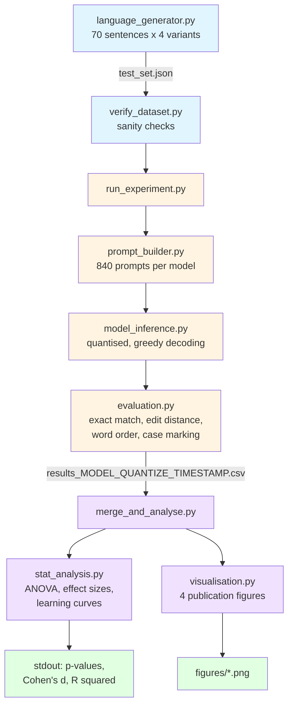

# Few-Shot Grammatical Learning in Large Language Models

A 2x2 factorial experiment investigating whether LLMs can acquire novel grammatical patterns from limited examples, using controlled synthetic languages.

## Overview

This project tests two LLMs — **Pythia-6.9B** (base) and **BLOOMZ-7B1** (instruction-tuned) — on their ability to learn synthetic Esperanto-inspired grammar rules through few-shot prompting. The experiment uses a factorial design crossing two grammatical features:

| | No Case Marking | Case Marking (-nom/-acc) |
|---|---|---|
| **SVO** (Subject-Verb-Object) | V1 | V3 |
| **VSO** (Verb-Subject-Object) | V2 | V4 |

Each variant is tested under three few-shot conditions (0-shot, 3-shot, 8-shot) across 70 test sentences, yielding **840 inference instances per model** (1,680 total).

### Hypotheses

- **H1:** Both models will show above-chance accuracy with few-shot examples, but will not reach ceiling performance
- **H2:** Case marking (morphological feature) will be harder to learn than word order (syntactic feature)
- **H3:** Accuracy improvements will show diminishing returns as shot count increases (logarithmic curve)

## Project Structure

```
llm_gramer/
├── language_generator.py   # Synthetic language & test set generation
├── prompt_builder.py       # Prompt construction for base & instruction models
├── model_inference.py      # Quantized model loading & text generation
├── evaluation.py           # Multi-level evaluation metrics
├── stat_analysis.py        # Factorial ANOVA, effect sizes, learning curves
├── visualisation.py        # Publication-quality figures
├── run_experiment.py       # Main experiment runner (single model)
├── merge_and_analyse.py    # Merge results & run full analysis pipeline
├── verify_dataset.py       # Dataset validation checks
├── config.yaml             # Experiment parameters
├── requirements.txt        # Python dependencies (GPU)
├── requirements.cpu.txt    # Python dependencies (CPU only)
├── requirements.amd.txt    # Python dependencies (AMD ROCm)
├── colab_experiment.ipynb  # Google Colab notebook runner
├── data/
│   └── test_set.json       # 70 generated test sentences (4 variants each)
├── results/                # Experiment output CSVs
└── figures/                # Generated visualisation PNGs
```

## Requirements

- **Python** 3.10+
- **GPU (recommended):** NVIDIA (CUDA 11.8+), AMD (ROCm 6.0+), or Apple Silicon (MPS)
- **CPU:** Supported as fallback (slower, no quantisation)

### GPU Fallback

The model inference pipeline auto-detects the best available device in this order:

1. **NVIDIA GPU** (CUDA) — full quantisation support (8-bit, 4-bit)
2. **AMD GPU** (ROCm) — requires `HSA_OVERRIDE_GFX_VERSION` for RDNA 3 GPUs
3. **Apple GPU** (MPS) — Metal Performance Shaders
4. **CPU** — automatic fallback, forces `quantize=none`

## Setup

### Local Installation

```bash
# Clone the repository
git clone <repo-url>
cd llm_gramer

# Create virtual environment
python -m venv venv
source venv/bin/activate  # Linux/macOS
venv\Scripts\activate     # Windows

# Install dependencies
pip install -r requirements.txt        # NVIDIA GPU
pip install -r requirements.cpu.txt    # CPU only
pip install -r requirements.amd.txt    # AMD GPU (also install PyTorch ROCm separately)
```

### AMD GPU (ROCm) Setup

For AMD GPUs (e.g., RX 7700 XT), use a conda environment:

```bash
conda create -n llm-grammar python=3.10
conda activate llm-grammar
pip install torch --index-url https://download.pytorch.org/whl/rocm6.0
pip install -r requirements.amd.txt
HSA_OVERRIDE_GFX_VERSION=11.0.0 python run_experiment.py --model smol
```

### Google Colab

For running on Google Colab's free T4 GPU (16 GB VRAM):

1. Upload `colab_experiment.ipynb` to [colab.google.com](https://colab.google.com)
2. Set runtime to **GPU** (Runtime > Change runtime type > T4 GPU)
3. Update the repo URL in cell 2
4. Run all cells

**Environment variables** (can be overridden locally):
- `RESULTS_DIR` — Directory for output CSVs (default: `results/`)
- `HF_HOME` / `TRANSFORMERS_CACHE` — Hugging Face model cache path

## Usage

### 1. Generate & Verify Test Data

The test set is auto-generated on the first experiment run if `data/test_set.json` doesn't exist. To generate and validate it separately:

```bash
python language_generator.py
python verify_dataset.py
python verify_dataset.py --verbose  # show 10 sample sentences instead of 3
```

The verifier checks sentence counts, verb type distribution, tense balance, duplicate detection, variant structure, and few-shot/test-set overlap.

### 2. Run Experiments

Run each model individually:

```bash
# Pythia-6.9B (base model, 8-bit quantisation)
python run_experiment.py --model pythia

# BLOOMZ-7B1 (instruction-tuned, 8-bit quantisation)
python run_experiment.py --model bloomz

# Pythia-70M (small model for testing)
python run_experiment.py --model smol

# 4-bit quantisation for lower VRAM usage
python run_experiment.py --model pythia --quantize 4bit

# CPU mode (no quantisation)
python run_experiment.py --model pythia --quantize none
```

Each run produces a timestamped CSV in `results/` with 840 rows (4 variants x 3 shot conditions x 70 sentences).

### 3. Merge Results & Analyse

Once both models have been run:

```bash
python merge_and_analyse.py \
    --model1 results/results_pythia_<timestamp>.csv \
    --model2 results/results_bloomz_<timestamp>.csv
```

This produces:
- `results/results_merged.csv` — Combined dataset (1,680 rows)
- `figures/learning_curves.png` — Accuracy vs shot count with 95% CI
- `figures/interaction_plot.png` — Syntax x morphology interaction
- `figures/heatmap.png` — Accuracy across all conditions
- `figures/error_analysis.png` — Word order vs case marking accuracy

## Pipeline Overview



## Evaluation Metrics

Each prediction is scored on four dimensions:

| Metric | Description |
|---|---|
| **Exact Match** | Binary — does the prediction match the gold standard exactly? |
| **Edit Distance** | Normalised Levenshtein distance (0 = identical, 1 = completely different) |
| **Word Order** | Does the verb appear in the correct position (2nd for SVO, 1st for VSO)? |
| **Case Marking** | Are -nom/-acc suffixes present/absent as expected for the variant? |

## Statistical Analysis

- **2x2 Mixed ANOVA** — Within-subjects factors: syntax (SVO/VSO) and morphology (case/no-case); between-subjects factor: model (Pythia/BLOOMZ)
- **Post-hoc Tests** — Pairwise comparisons with Bonferroni correction (alpha = 0.05, 6 comparisons)
- **Effect Sizes** — Cohen's d for key comparisons
- **Learning Curves** — Logarithmic regression fit across shot conditions

## Configuration

All experiment parameters are centralised in `config.yaml`:

| Section | Key Parameters |
|---|---|
| `experiment` | `seed: 42`, `output_dir: results/` |
| `models` | Model names, quantisation level (`8bit`/`4bit`/`none`) |
| `conditions` | Variants (`v1`-`v4`), shot counts (`0, 3, 8`) |
| `data` | Sentence counts per verb type (total: 70) |
| `generation` | `max_new_tokens: 64`, `do_sample: false`, greedy decoding |
| `statistics` | `alpha: 0.05`, `bonferroni_comparisons: 6` |

## Synthetic Language Design

The experiment uses Esperanto-inspired vocabulary (50 lexical items) to create a controlled artificial language. Sentences cover:

- **Verb types:** transitive (20), intransitive (20), ditransitive (20), adjective-modified (10)
- **Tenses:** past, present, future
- **Four grammatical variants** combining word order and case marking

This design isolates grammatical learning from prior knowledge — the models cannot rely on memorised patterns from pre-training.

## Output Format

Results CSVs contain one row per inference instance:

```
model, quantize, variant, shot_count, sentence_id, english, gold, prediction,
exact_match, edit_distance, word_order_correct, case_marking_correct
```

## License

MIT
